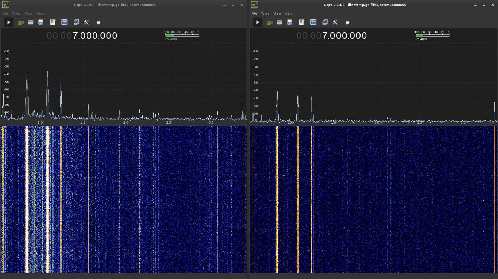

## CX2388x SDR V4L2 Driver for Linux 4.19+

### Loading the SDR module

Blacklist the cx88* modules:

```
$ sudo cp ./conf/cx88_sdr.conf /etc/modprobe.d
```

After reboot, under ./src run:

```
$ make
$ sudo modprobe videodev
$ sudo insmod cx88_sdr.ko
```

### Using Gqrx with 28.8 MHz sample rate, 8-bit (default v4l2 option)

Install `gqrx-sdr` and `qv4l2`, then run:

```
$ mkfifo /tmp/gr-fifo0
```

Open ./grc/`RU08_to_IQ_v38.grc`, with the GNU Radio (v3.8+) flowgraph running, launch Gqrx with this device string:

```
file=/tmp/gr-fifo0,rate=28800000
```
The Gqrx sample rate should match the one selected in qv4l2.
Open `/dev/swradio0` with `qv4l2` and change the input pin so you can connect an antenna to one of the video inputs.
You will have to modify or remove the LPF from the PCB in order to use the entire frequency range.

Here is a screenshot with 2 Gqrx instances running:


### Unloading the module

```
$ sudo rmmod -f cx88_sdr
```
